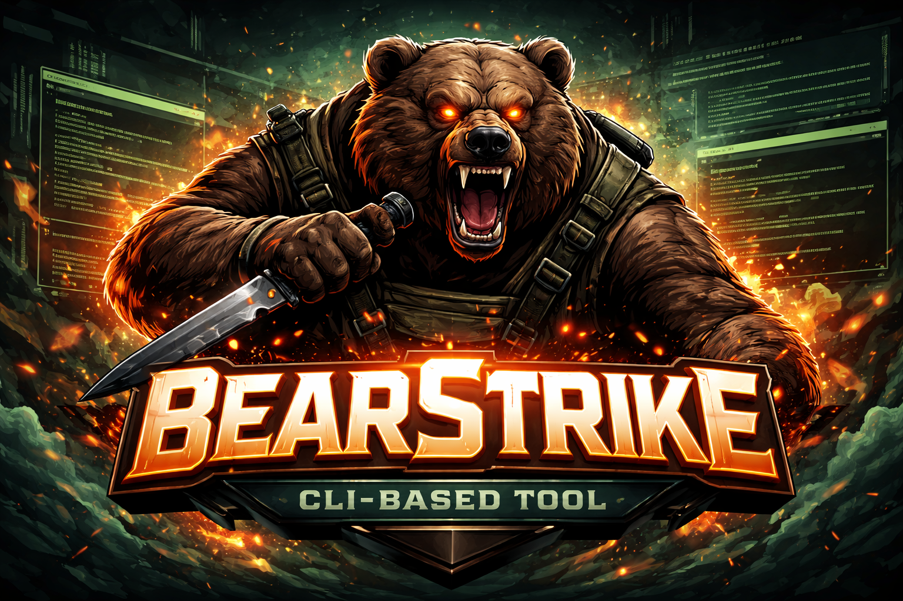
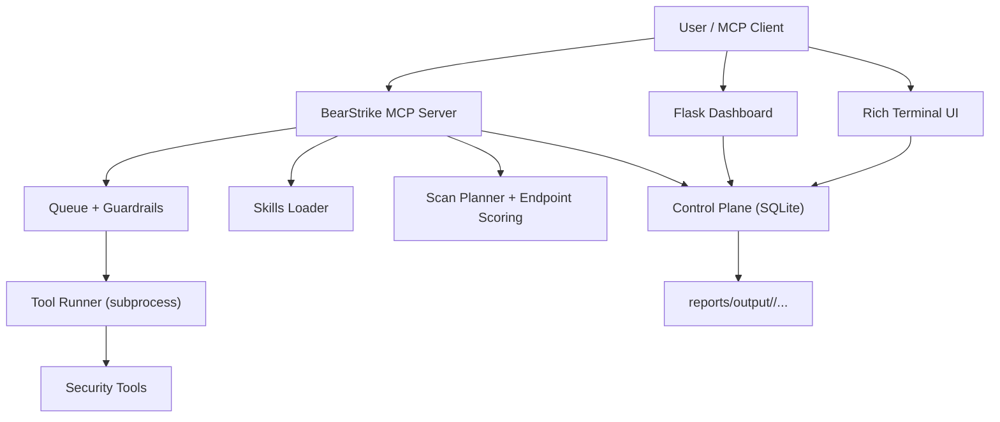
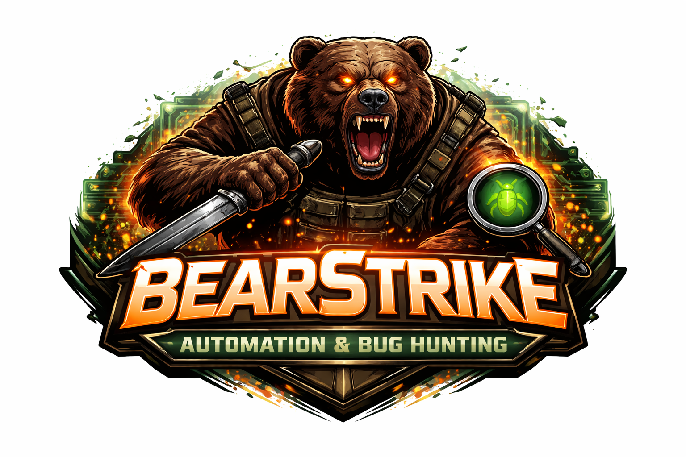

<div align="center">
  

# BearStrike AI

### High-Signal Pentesting Console (MCP-First, Model-Agnostic)

[](https://www.python.org/)
[](LICENSE)
[](https://modelcontextprotocol.io/)
[](#installation)
[](#tooling)

Build fast, low-noise security workflows with queue-first execution, skills-aware planning, and production-grade runtime state.

</div>

## 🚀 BearStrike AI Highlights

**BearStrike AI** is engineered for **high-signal pentesting** and **bug bounty workflows**, cutting through noise with intelligent AI orchestration. Here’s what makes it stand out:

-   🎯 **Target Control + WAF Context**: Understand your target’s defenses at a glance.
-   🧠 **Smart Planner Panel**: AI-driven planning prioritizes high-value attack paths.
-   ⏱️ **Async Jobs + Output Timeline**: Monitor scans in real-time with detailed logs.
-   🛠️ **Tool List with Category/Status Filtering**: Manage 150+ integrated security tools effortlessly.
-   🧹 **Maintenance Panel for Retention/Cleanup**: Keep your workspace clean and efficient.

### ✨ Featured On:

[](https://mcpmarket.com/server/bearstrike-ai)

---

## Table of Contents

- [Why BearStrike](#why-bearstrike)
- [Architecture](#architecture)
- [Core Capabilities](#core-capabilities)
- [Installation](#installation)
- [Quick Start](#quick-start)
- [MCP Client Setup](#mcp-client-setup)
- [Tool Use Modes](#tool-use-modes)
- [Common Workflows](#common-workflows)
- [Dashboard](#dashboard)
- [Tooling](#tooling)
- [Skills Playbooks](#skills-playbooks)
- [Data and Retention](#data-and-retention)
- [Project Structure](#project-structure)
- [Troubleshooting](#troubleshooting)
- [Legal and Safety](#legal-and-safety)

---

## Why BearStrike

BearStrike is built for practical bug hunting where signal matters more than scan noise:

- Queue-first execution to prevent MCP request stalls.
- Request dedupe + response caching to reduce repeated scans and token waste.
- Skills-first workflow for planning before offensive steps.
- Durable control plane (`SQLite + file artifacts`) for stable state across sessions.
- Model/client-agnostic MCP compatibility (Claude Desktop, VS Code, Cursor, more).
- User-driven hunt mode by default (no forced autonomous chatter loops).

---

## Architecture



---

## Core Capabilities

### 1) MCP Control Layer
- `stdio` + `sse` transports.
- Queue-first direct calls with short wait + async fallback.
- Concurrency limits, heavy-scan cooldown, and tool timeout profiles.
- Exact exposure checks via `mcp_tool_inventory`.

### 2) Smart Execution Guardrails
- Fingerprint dedupe (`tool + target + params + mode + scope_tag`).
- Cache TTL profiles (`low_noise`, `balanced`, `aggressive`).
- Per-target heavy tool controls to reduce rate-limit spikes.

### 3) Intelligence + Planning
- Deterministic endpoint scoring (1-10).
- Priority-band driven planning for high-value paths.
- Curated research ingestion and query support.

### 4) Dashboard Operations
- Tool registry with category/status filters.
- Async jobs panel with queue state and output preview.
- Planner + prioritized endpoints panel.
- Cache/dedupe/queue metrics + maintenance controls.

---

## Installation

### Requirements
- Python `3.10+`
- Linux/WSL recommended for full tool compatibility
- Toolchain like `nmap`, `httpx`, `subfinder`, `wafw00f`, `nuclei` (as needed)

### Setup

```bash
git clone <your-repo-url> bearstrike-ai
cd bearstrike-ai
python3 -m pip install -r requirements.txt
```

### Configure

Edit `config.json`:

```json
{
  "ai_provider": "anthropic",
  "anthropic_api_key": "your-key-here",
  "claude_model": "claude-sonnet-4-20250514",
  "openai_api_key": "",
  "openai_model": "gpt-4o-mini",
  "openai_base_url": "https://api.openai.com/v1",
  "dashboard_port": 3000,
  "mcp_port": 8888,
  "auto_hunt": false,
  "default_target": "",
  "queue_max_concurrency": 2,
  "heavy_scan_per_target": 1,
  "heavy_scan_cooldown_seconds": 45,
  "mcp_direct_wait_seconds": 6,
  "research_refresh_interval_hours": 24,
  "cache_ttl_profile": {
    "low_noise": 7200,
    "balanced": 2400,
    "aggressive": 600
  },
  "endpoint_score_thresholds": {
    "high": 8,
    "medium": 5
  }
}
```

---

## Quick Start

### Full stack (Terminal + Dashboard + MCP)

```bash
python3 main.py
```

### Start with target

```bash
python3 main.py example.com
```

### Standalone mode (no MCP/AI loop)

```bash
python3 main.py --standalone
```

### Help

```bash
python3 main.py --help
```

---

## MCP Client Setup

BearStrike supports both MCP transports:

- `stdio` for Claude Desktop, Cursor, and VS Code MCP clients.
- `sse` for HTTP/SSE-capable MCP clients.

### 1) Stdio (recommended)

Run manually:

```bash
python3 /home/himanshu/xHunt/bearstrike-ai/core/mcp_server.py --transport stdio
```

### 2) Claude Desktop (Windows + WSL)

Open Claude Desktop MCP config and add:

```json
{
  "mcpServers": {
    "bearstrike-ai": {
      "command": "wsl",
      "args": [
        "-d",
        "kali-linux",
        "python3",
        "/home/himanshu/xHunt/bearstrike-ai/core/mcp_server.py",
        "--transport",
        "stdio"
      ]
    }
  }
}
```

Then restart Claude Desktop and check Developer -> Local MCP Servers.

### 3) Cursor MCP config

Add BearStrike in Cursor's MCP JSON:

```json
{
  "mcpServers": {
    "bearstrike-ai": {
      "command": "wsl",
      "args": [
        "-d",
        "kali-linux",
        "python3",
        "/home/himanshu/xHunt/bearstrike-ai/core/mcp_server.py",
        "--transport",
        "stdio"
      ]
    }
  }
}
```

### 4) VS Code MCP config

Use the same `mcpServers` entry in VS Code MCP settings.

### 5) Generic local Linux config

```json
{
  "mcpServers": {
    "bearstrike-ai": {
      "command": "python3",
      "args": [
        "/home/himanshu/xHunt/bearstrike-ai/core/mcp_server.py",
        "--transport",
        "stdio"
      ]
    }
  }
}
```

### 6) SSE (HTTP clients)

```bash
python3 /home/himanshu/xHunt/bearstrike-ai/core/mcp_server.py --transport sse --port 8888
```

SSE endpoint: `http://127.0.0.1:8888/sse`

---

## Tool Use Modes

BearStrike supports two dimensions of control:

### A) Scan mode (`mode`)

- `low_noise`: safest profile, longest cache TTL, fewer aggressive calls.
- `balanced`: default profile, practical mix of speed and safety.
- `aggressive`: shortest TTL and faster probing; higher block/rate-limit risk.

Use `low_noise` for protected targets and bounty programs.

### B) Hunt strategy (`strategy`)

- `adaptive`: phased and smart (recommended). Runs 1-2 key tools, analyzes signal, then selects next tools.
- `diversified`: broader category coverage while still controlled.
- `all`: queues a wide set of compatible tools quickly (high volume).

Default recommendation:

- Start: `mode=low_noise`, `strategy=adaptive`
- Expand: `mode=balanced`, `strategy=diversified`
- Only when needed: `strategy=all`

### Inspect mode options (MCP)

Use `hunt_options` to see current defaults and available strategy/mode values.

---

## Common Workflows

### 1) Minimal safe flow (recommended)

1. `set_target`
2. `detect_waf`
3. `plan_scan`
4. `full_hunt` with `strategy=adaptive`
5. Track with `list_jobs`, then `job_result`
6. Generate report with `get_target_report`

### 2) Async-heavy flow (prevents MCP timeout)

- Queue: `start_tool`
- Monitor: `job_status`
- Read output: `job_result`

This is preferred for long tools (`subfinder`, `nuclei`, large crawls).

### 3) Full campaign flow (broad)

```json
{
  "target": "example.com",
  "mode": "balanced",
  "include_subdomains": true,
  "max_subdomains": 60,
  "max_tools": 0,
  "strategy": "all",
  "fanout_tools_per_target": 8,
  "verbose": false
}
```

Notes:
- `max_tools=0` means all compatible installed tools.
- `verbose=false` reduces MCP response chatter and token burn.
- If rate-limited, switch to `strategy=adaptive` and `mode=low_noise`.

---

## Dashboard

Open the URL printed at startup (for example `http://127.0.0.1:3001`).

Features:
- Target control + WAF context.
- Smart planner panel.
- Async jobs + output timeline.
- Tool list with category/status filtering.
- Maintenance panel for retention/cleanup.

Main APIs:
- `GET /api/tools`
- `GET /api/dashboard`
- `GET /api/jobs`
- `POST /api/jobs/start`
- `POST /api/target`
- `GET /api/endpoints/prioritized`
- `GET /api/research/summary`
- `POST /api/research/refresh`
- `GET /api/cache/stats`
- `GET /api/dedupe/stats`
- `POST /api/maintenance/purge`

---

## Tooling

BearStrike includes 150+ tool profiles across categories:
- Recon
- Web
- Exploit
- Cloud
- Binary
- Forensics
- Misc

Core MCP helper tools:
- `health`
- `list_tools`
- `mcp_tool_inventory`
- `tools_status`
- `set_target`
- `detect_waf`
- `execute_tool`
- `start_tool`
- `job_status`
- `job_result`
- `list_jobs`
- `plan_scan`
- `smart_scan`
- `full_hunt`
- `score_endpoint`
- `research_refresh`
- `research_query`
- `cache_stats`
- `dedupe_stats`
- `queue_stats`
- `purge_old_data`

### Broad Campaign Example (`full_hunt`)

Use one call to queue a wide, no-prompt campaign over the main target and discovered subdomains:

```json
{
  "target": "example.com",
  "mode": "balanced",
  "include_subdomains": true,
  "max_subdomains": 60,
  "max_tools": 0,
  "strategy": "diversified",
  "fanout_tools_per_target": 12
}
```

Notes:
- `max_tools=0` means all compatible installed tools.
- `strategy=all` uses pure priority order.
- `strategy=diversified` spreads coverage across categories.

---

## Skills Playbooks

BearStrike includes a skills-first playbook layer under `skills/`.  
These are designed to be read before heavy scanning so MCP clients choose high-signal steps first.

Current skill modules:
- `planning` - pre-scan decision flow and priorities
- `recon` - recon sequencing and endpoint discovery
- `pentest-tools` - tool-selection policy by target and risk
- `bug-hunting` - end-to-end bug hunting methodology
- `exploitation` - PoC quality and false-positive elimination
- `reporting` - structured reporting templates and evidence standards
- `research-notes` - latest research patterns and bug classes
- `traffic-proxy` - interception workflow (mitmproxy/ZAP-style usage)
- `xray-suite` - xray/crawlergo/headless-browser specific guidance

Recommended MCP behavior:
- Load `planning` + `research-notes` first.
- Use `mode=low_noise` + `strategy=adaptive` by default.
- Escalate to broader tool sets only after signal is found.
- Keep `verbose=false` in long hunts to reduce response chatter/token burn.

---

## Data and Retention

Control plane DB: `data/bearstrike.db`  
Artifacts: `reports/output/<target_slug>/...`

Retention controls:
- Purge runtime data older than N days (recommended: 7 days).
- Optional full clear-all reset from dashboard/API.

Examples:
- `purge_old_data(days=7, include_research=false, vacuum=true)`
- `purge_old_data(clear_all=true, vacuum=true)`

---

## Project Structure

```text
bearstrike-ai/
├── core/
│   ├── mcp_server.py
│   ├── control_plane.py
│   ├── scan_planner.py
│   ├── reporting.py
│   ├── strategist.py
│   ├── tool_registry.py
│   └── tool_runner.py
├── dashboard/
│   ├── server.py
│   ├── templates/index.html
│   └── static/
├── terminal/
│   ├── display.py
│   ├── live_feed.py
│   └── colors.py
├── skills/
├── tools/
├── reports/
├── data/
├── docs/images/
├── main.py
├── config.json
└── README.md
```

---

## Visual Identity

<div align="center">
  
  
</div>

---

## Troubleshooting

### Only a few MCP tools appear
- Start MCP server without compact mode.
- Restart your MCP client app (tool schemas can be cached).
- Run `mcp_tool_inventory` to verify exposed tools from server side.

### MCP timeouts
- Use async flow for heavy scans: `start_tool` -> `job_status` -> `job_result`.
- Prefer `mode="low_noise"` for WAF-protected targets.
- Avoid parallel heavy scans on same target.

### Dashboard port conflict
- BearStrike auto-selects next free port and prints final URL.

---

## Legal and Safety

Use BearStrike only on systems you own or are explicitly authorized to test.

- No unauthorized testing.
- Follow program policy (HackerOne, Bugcrowd, TryHackMe, private scopes).
- Respect rate limits and safe-disclosure rules.

---

## License

MIT License. See [LICENSE](LICENSE).
